# blockchain_dev_assessment

Welcome to your new AlgoKit project!

This is your workspace root. A `workspace` in AlgoKit is an orchestrated collection of standalone projects (backends, smart contracts, frontend apps and etc).

By default, `projects_root_path` parameter is set to `projects`. Which instructs AlgoKit CLI to create a new directory under `projects` directory when new project is instantiated via `algokit init` at the root of the workspace.

## Getting Started

To get started refer to `README.md` files in respective sub-projects in the `projects` directory.

To learn more about algokit, visit [documentation](https://github.com/algorandfoundation/algokit-cli/blob/main/docs/algokit.md).

### GitHub Codespaces

To get started execute:

1. `algokit generate devcontainer` - invoking this command from the root of this repository will create a `devcontainer.json` file with all the configuration needed to run this project in a GitHub codespace. [Run the repository inside a codespace](https://docs.github.com/en/codespaces/getting-started/quickstart) to get started.
2. `algokit init` - invoke this command inside a github codespace to launch an interactive wizard to guide you through the process of creating a new AlgoKit project

Powered by [Copier templates](https://copier.readthedocs.io/en/stable/).

---

## **Localnet deployment and testing**

#### Deployment on Localnet
- returns Hello, how are you Nikhil?
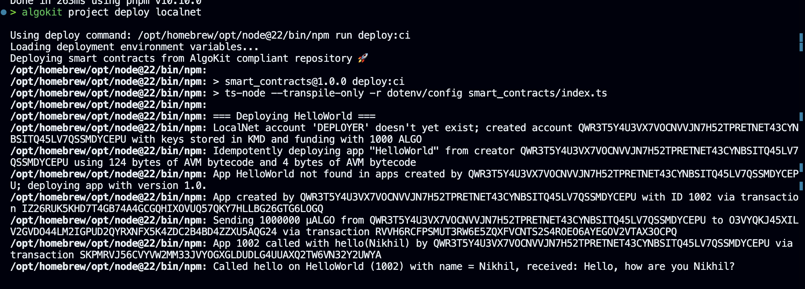

---
#### Added the deployment on Lora explorer running locally

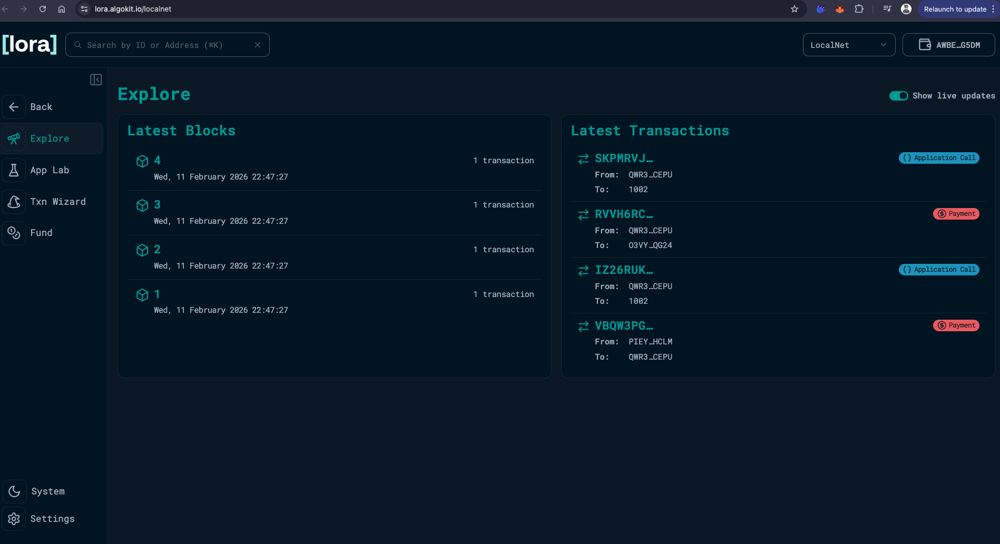
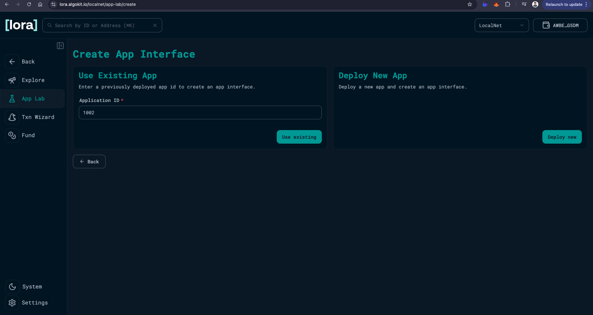

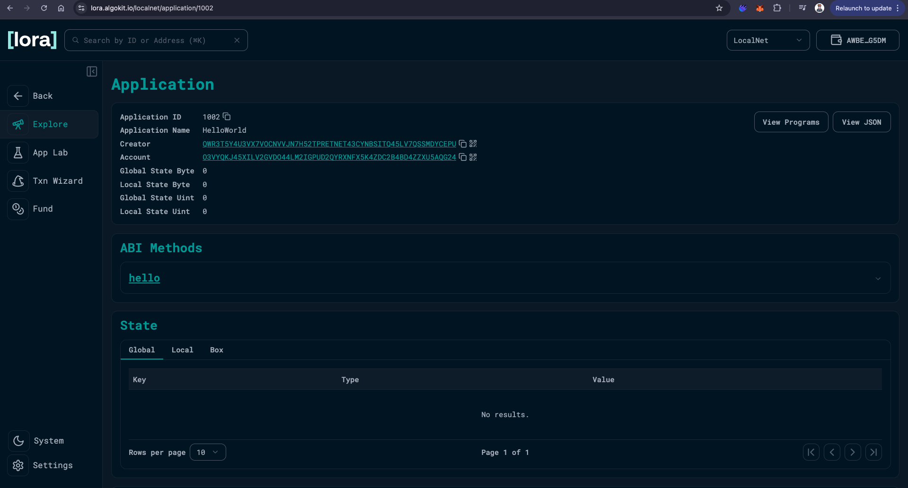

---

#### Testing with Name 'Praveen'
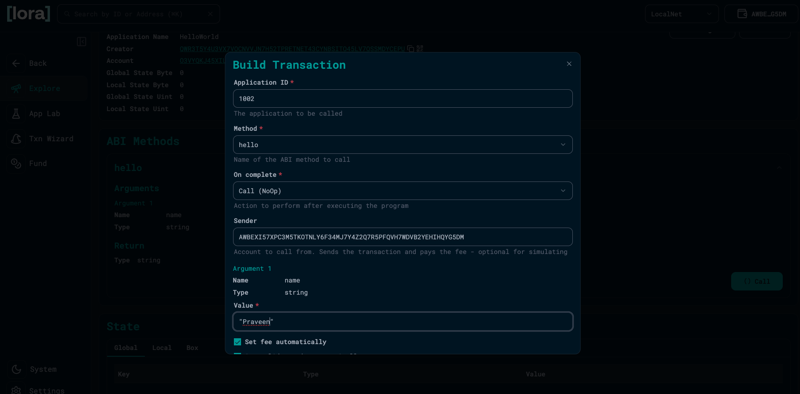
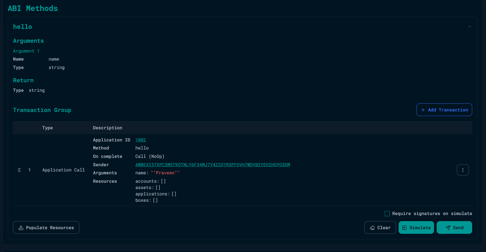
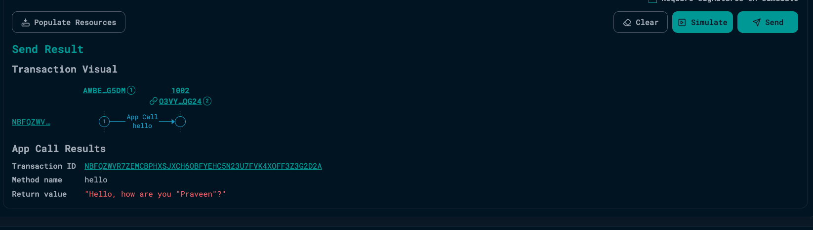

## **Public Testnet deployment and testing [*BONUS work*]**

#### Account setup for testnet account
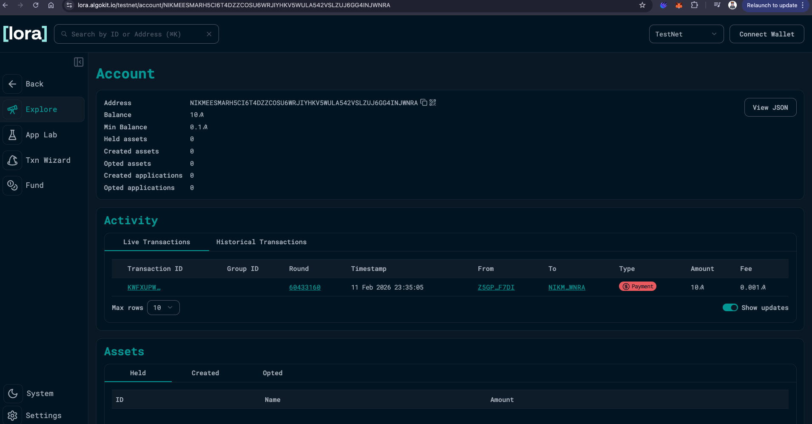

----

#### Deployment on testnet
- check logs
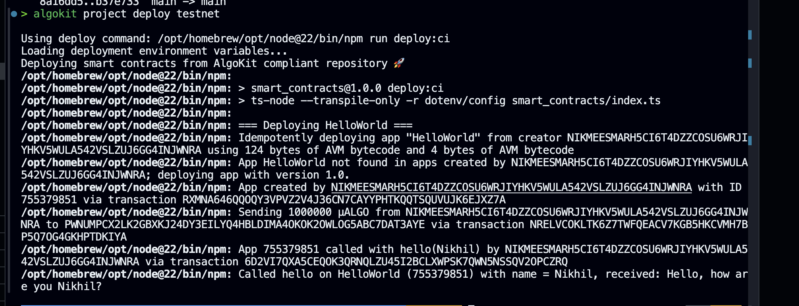

---

#### Adding the deployment to App Lab in Lora
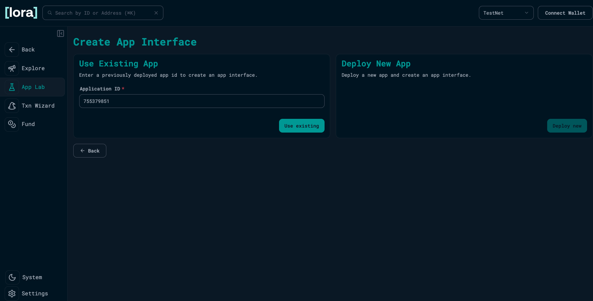
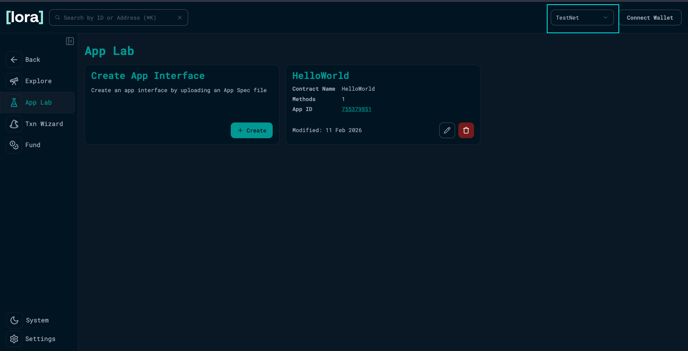

---

## Deployment Details on LocalNet:-
- **Application ID**: 755379851
- **Application Name**: HelloWorld
- **Creator**: NIKMEESMARH5CI6T4DZZCOSU6WRJIYHKV5WULA542VSLZUJ6GG4INJWNRA
- **Account**: PWNUMPCX2LK2GBXKJ24DY3EILYQ4HBLDIMA4OKOK2OWLOG5ABC7DAT3AYE
- **State**: Box

---

